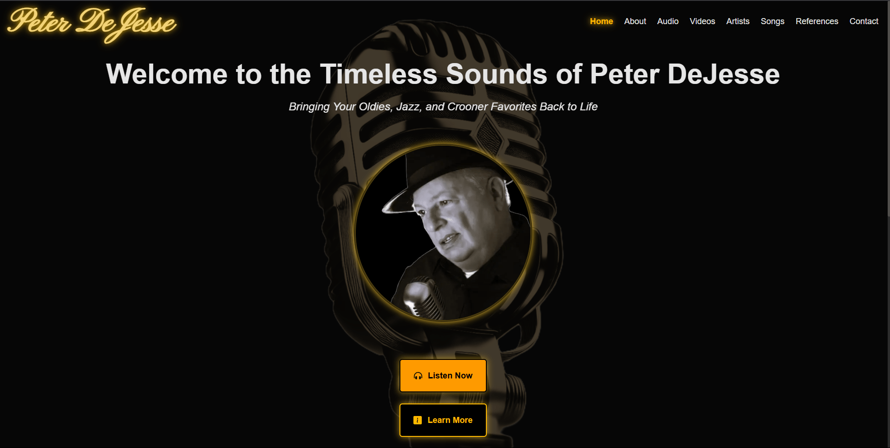
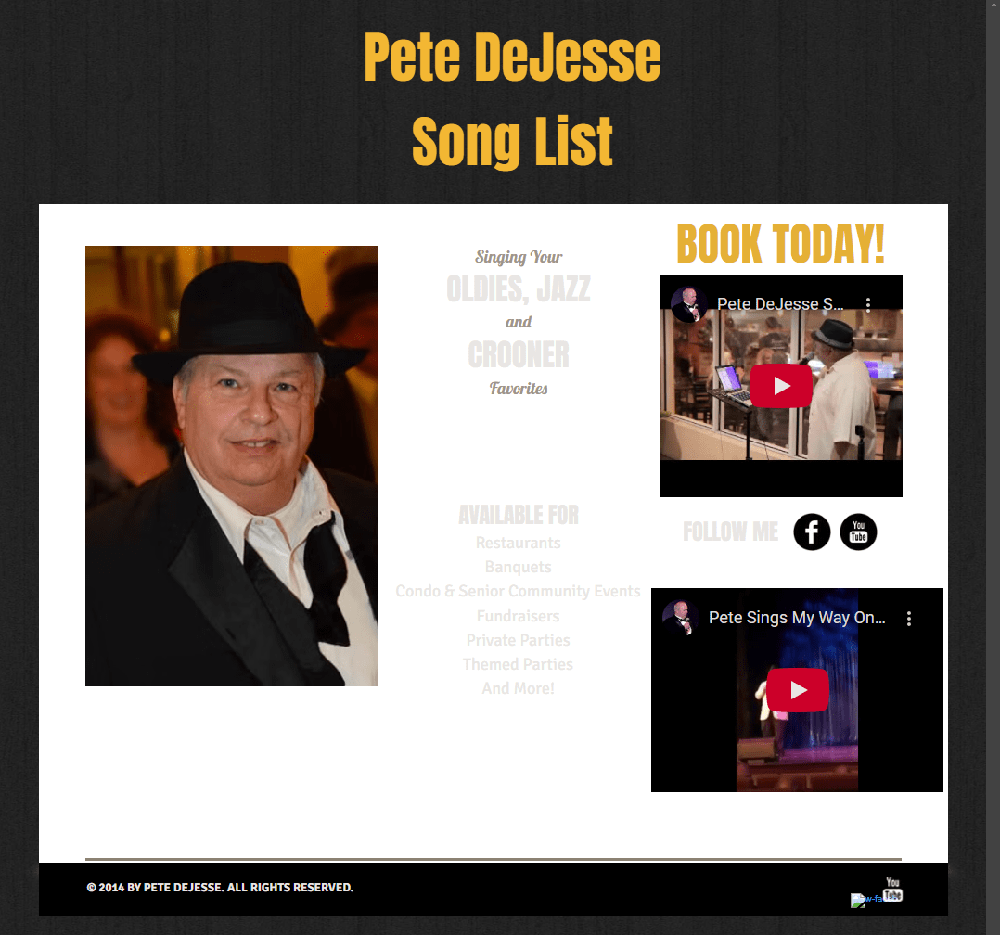

# Pete DeJesse - Timeless Music Website

> “Bringing Your Oldies, Jazz, and Crooner Favorites Back to Life”

## Screenshot

**_New Design:_**



**_Old Design:_**



---

## Table of Contents

- [Pete DeJesse - Timeless Music Website](#pete-dejesse---timeless-music-website)
  - [Screenshot](#screenshot)
  - [Table of Contents](#table-of-contents)
  - [Live Deployment](#live-deployment)
  - [Description](#description)
  - [Tech Stack](#tech-stack)
  - [Project Structure](#project-structure)
  - [Scripts](#scripts)
  - [Repo Status](#repo-status)
  - [Client Background](#client-background)
  - [Contact](#contact)
  
## Live Deployment

To listen to Pete, check out the site, or book an event visit: [petedejesse.com](https://www.petedejesse.com).

---

## Description

A modern, mobile-responsive artist website built with **Next.js** and **TypeScript** for retired firefighter and vocalist **Pete DeJesse**, bringing the charm of Oldies, Jazz, and Crooner classics to life with a sleek digital presence.

This site was created to refresh an outdated 2000s-era design with a bold, modern aesthetic — complete with embedded video/audio players, contact form integration, and mobile-first responsiveness. Built as a **static Next.js site**, it loads fast and scales cleanly with modern hosting platforms.

> 🔒 _Note: The source code for this site is private due to client ownership._

---

## Tech Stack

| Technology               | Description                             | Documentation |
|--------------------------|-----------------------------------------|----------------|
| **Next.js**              | React framework for production          | [nextjs.org](https://nextjs.org/) |
| **TypeScript**           | Typed JavaScript superset               | [typescriptlang.org](https://www.typescriptlang.org/) |
| **Tailwind CSS**         | Utility-first CSS framework             | [tailwindcss.com](https://tailwindcss.com/) |
| **EmailJS**              | Client-side email delivery service      | [emailjs.com](https://www.emailjs.com/docs/) |
| **react-google-recaptcha** | Google ReCAPTCHA v2 integration      | [npmjs.com/package/react-google-recaptcha](https://www.npmjs.com/package/react-google-recaptcha) |
| **react-icons**          | Popular icon packs as React components  | [react-icons.github.io](https://react-icons.github.io/react-icons/) |
| **ESLint**               | Linter for JavaScript and TypeScript    | [eslint.org](https://eslint.org/) |

---

## Project Structure

> _Private repo structure overview:_

```md
petedejesse.com/
├── .next/                   # Next.js build output
├── .vscode/                 # Editor settings
├── node_modules/            # Dependencies
├── public/                  # Static assets
│   ├── downloads/
│   ├── fonts/
│   ├── images/
│   ├── songs/
│   └── favicon.ico
├── src/                     # Source code
│   ├── components/          # Reusable UI components
│   ├── data/                # Static data files or content
│   ├── pages/               # Next.js routes
│   ├── styles/              # Tailwind/global CSS
│   ├── hooks.tsx            # Custom hooks
│   └── utils.ts             # Utility functions
├── .env.local               # Environment variables
├── .gitignore
├── eslint.config.mjs       # ESLint configuration
├── next-env.d.ts
├── next.config.ts          # Next.js config
├── package.json            # Scripts and dependencies
├── package-lock.json
├── postcss.config.mjs      # PostCSS setup
├── README.md
└── tsconfig.json           # TypeScript configuration
```

---

## Scripts

| Command        | Description                  |
|----------------|------------------------------|
| `npm run dev`  | Start local dev server       |
| `npm run build`| Build static site            |
| `npm start`    | Serve production build       |
| `npm run lint` | Run ESLint on source code    |

---

## Repo Status

> This repository serves as a **public-facing showcase** for the **live deployment** only.  
> The source code resides in a **private repo** for client confidentiality and licensing reasons.

---

## Client Background

Pete DeJesse is a **retired firefighter turned professional entertainer**, performing classic hits from the likes of Sinatra, Bennett, and Darin. This website offers:

- Song lists
- Embedded YouTube videos
- Audio clips
- Song and artist lists
- Contact and booking information

---

## Contact

Developed by [`Anthony Tropeano`](https://atropeano.com)  

For business or freelance inquiries please email: [`anthony@atropeano.com`](mailto:anthony@atropeano.com)
